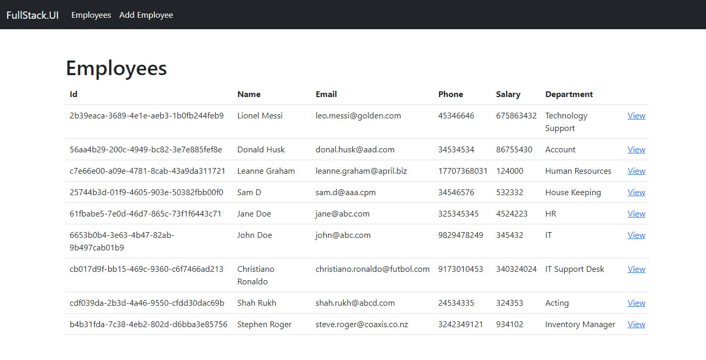
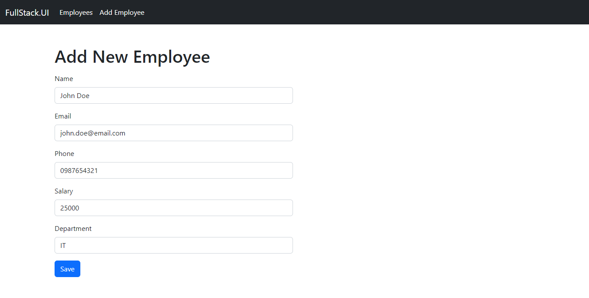
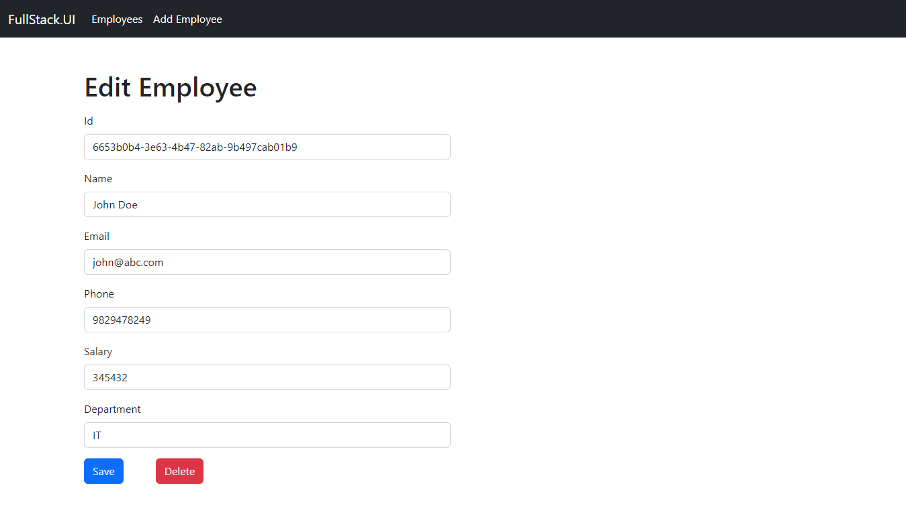

# Employee Management Tool
Employee Management tool built with Angular 14, .Net 6 Web API using Entity Framework Core

The API implements CRUD operations<br>
The API stores the data using SQL Server Database and the Database operations are performed using Entity Framework Core & EF Migrations<br>
<br>
The API is built based on the YouTube video [Angular 14 CRUD with .NET 6 Web API using Entity Framework Core - Full Course](https://www.youtube.com/watch?v=CdE6rVfPJ9I)
<br>

## Employee Management Tool UI

### View All Employees


### Add new Employee


### Edit or Delete Employee



# Usage

Simply follow below steps:
- For API:
1. `git clone https://github.com/saideepd/employee-management`
2. `cd FullStack API\FullStack.API`
3. `dotnet run --project FullStack.API`
<br><br>

- For UI:
1. `git clone https://github.com/saideepd/employee-management`
2. `cd FullStack UI\FullStack.UI`
3. `npm install`
4. `ng serve -o`
<br><br>

## Employee Management Tool API

## API Definition

## Get Employees

### Get All Employees Request

```js
GET /api/Employees
```
### Get All Employees Response

```js
200 OK
```

```json
[
  {
    "id": "61fbabe5-7e0d-46d7-865c-73f1f6443c71",
    "name": "Jane Doe",
    "email": "jane@abc.com",
    "phone": 325345345,
    "salary": 4524223,
    "department": "HR"
  },
  {
    "id": "6653b0b4-3e63-4b47-82ab-9b497cab01b9",
    "name": "John Doe",
    "email": "john@abc.com",
    "phone": 9829478249,
    "salary": 345432,
    "department": "IT"
  }
]
```

### Get Single Employee Request

```js
GET /api/Employees/{{id}}
```
### Get Employee Response

```js
200 OK
```

```json
[
  {
    "id": "6653b0b4-3e63-4b47-82ab-9b497cab01b9",
    "name": "John Doe",
    "email": "john@abc.com",
    "phone": 9829478249,
    "salary": 345432,
    "department": "IT"
  }
]
```

## Add Employee

### Add Employee Request

```js
POST /api/Employees
Body
{
  "name": "John Doe",
  "email": "john@abc.com",
  "phone": 9829478249,
  "salary": 345432,
  "department": "IT"
}
```
### Add Employee Response

```js
200 OK
```

```json
[
  {
    "id": "6653b0b4-3e63-4b47-82ab-9b497cab01b9",
    "name": "John Doe",
    "email": "john@abc.com",
    "phone": 9829478249,
    "salary": 345432,
    "department": "IT"
  }
]
```

## Edit Employee

### Edit Employee Request

```js
PUT /api/Employees/{{id}}
Body
{
  "name": "John Doe",
  "email": "john@abc.com",
  "phone": 9876543210,
  "salary": 54000,
  "department": "IT Manager"
}
```
### Edit Employee Response

```js
200 OK
```

```json
[
  {
    "id": "6653b0b4-3e63-4b47-82ab-9b497cab01b9",
    "name": "John Doe",
    "email": "john@abc.com",
    "phone": 9876543210,
    "salary": 54000,
    "department": "IT Manager"
  }
]
```


## Delete Employee

### Delete Employee Request

```js
DELETE /api/Employees/{{id}}
```
### Delete Employee Response

```js
200 OK
```

```json
[
  {
    "id": "6653b0b4-3e63-4b47-82ab-9b497cab01b9",
    "name": "John Doe",
    "email": "john@abc.com",
    "phone": 9876543210,
    "salary": 54000,
    "department": "IT Manager"
  }
]
```

## Unsuccessful Requests
If any of the API does not have a matching record present in the Database to perform the respective operations, then the API returns 404 Not Found as response

### API Requests

```js
GET /api/Employees/{{id}}
```
```js
PUT /api/Employees/{{id}}
```
```js
DELETE /api/Employees/{{id}}
```

### Unsuccessful Request Response
```js
404 Not Found
```
```json
{
  "type": "https://tools.ietf.org/html/rfc7231#section-6.5.4",
  "title": "Not Found",
  "status": 404,
  "traceId": "00-049191ed4040ae3b5fcb8cbb09908cc7-d69eb9f86a77c0f0-00"
}
```
